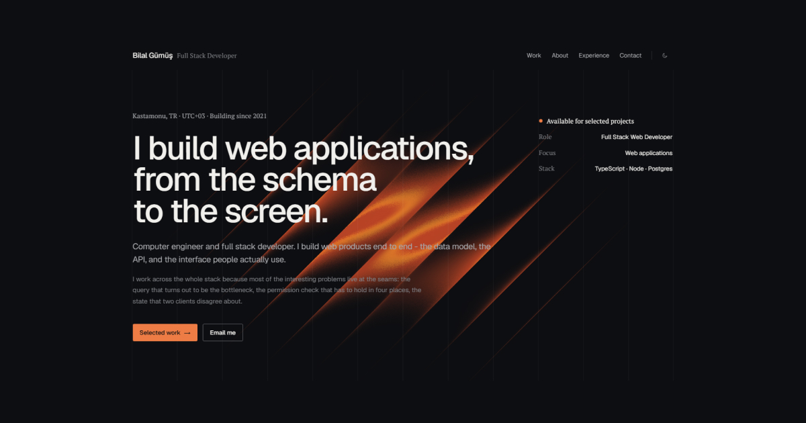

# Personal Website

Hi 👋, This is my portfolio website which is created with [NextJS](https://nextjs.org/), [TailwindCSS](https://tailwindcss.com/) & more.

## Project

🟠 You can see live at: https://bilalgumus.net



> Screenshot from the website

### Instructions

This project was bootstrapped with [create-next-app](https://www.npmjs.com/package/create-next-app).

#### View On Local

First clone this repository.

```bash
$ git clone https://github.com/BilalGumus/portfolio.git
```

In the project directory, you can run: (Make sure you already have [`nodejs`](https://nodejs.org/en/) & [`npm`](https://www.npmjs.com/) installed in your system.)

```bash
npm install && npm run dev
```

Runs the app in the development mode.

Open [http://localhost:3000](http://localhost:3000) to view it in the browser.
